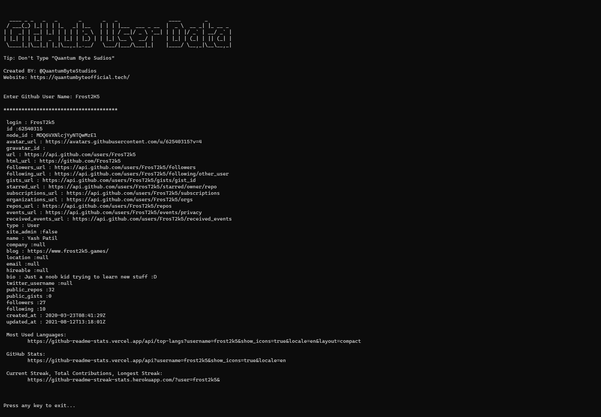

# GitHubUserDataExtracter 
A Tool Which Gives Access To Some Information about any user on GitHub, directly on your Terminal Screen :)

 

 

<h2>Linux Users!</h2> 

    git clone https://github.com/QuantumByteStudios/GitHubUserDataExtracter.git
