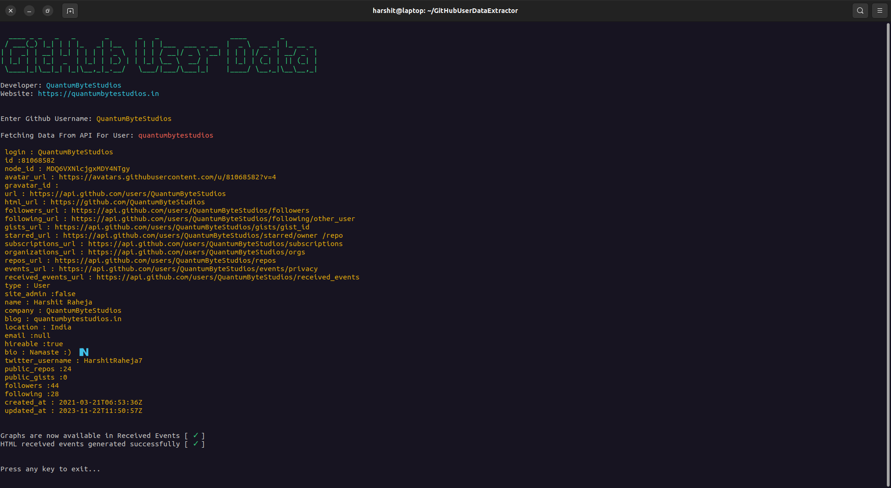
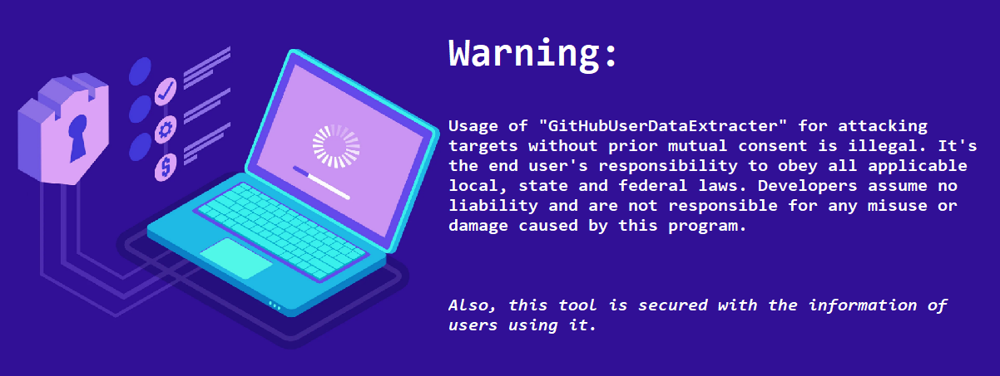
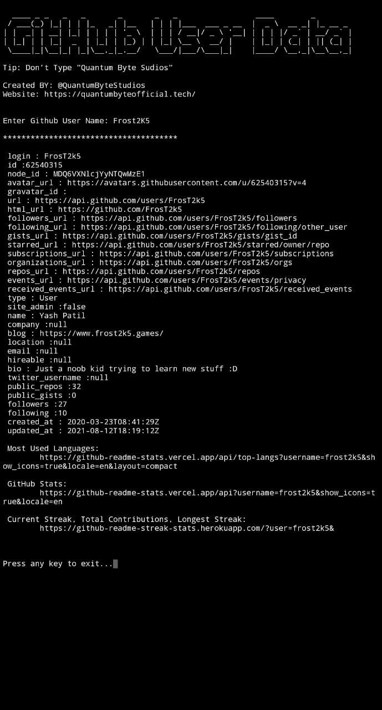
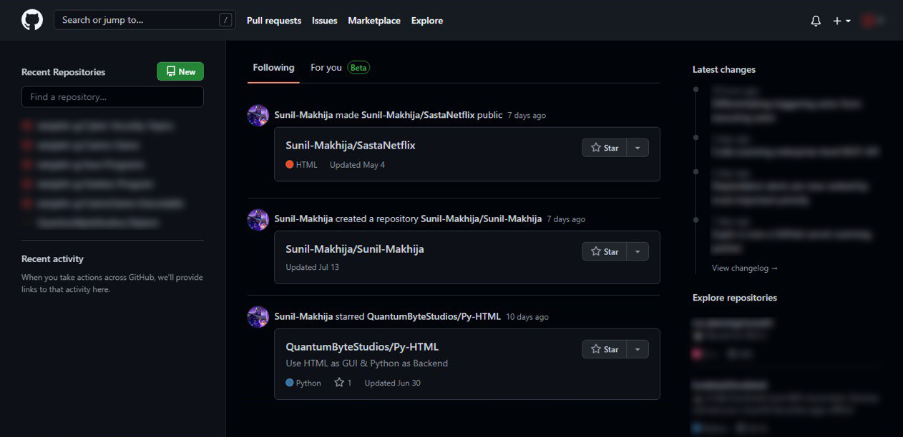
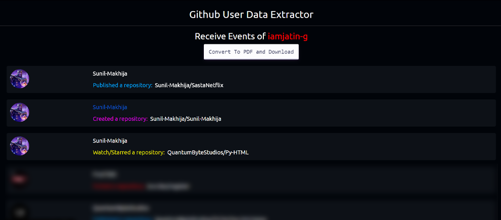

    

<h1 align="center">GitHubUserDataExtractor</h1>

A Tool Which Gives Access To Some Information about any user on GitHub, directly on your Terminal Screen 
For information on all the most recent upgrades and changes, read this <a href="changelog.md">changelog</a>.

&nbsp;

<h2>Linux Users!</h2>
    
    git clone https://github.com/QuantumByteStudios/GitHubUserDataExtractor.git --depth=1

# Runtime Screenshots

    

<!--  -->
<!---->
 

# Update: You Now Have Access to the GitHub Feed!

 Note: Only Release, Create, Publish, Fork, Star/Watch Events are Visible

<b>Actual Feed of User: </b> 

    

<b>Here's How You Will Get To See: </b> 

    

 
